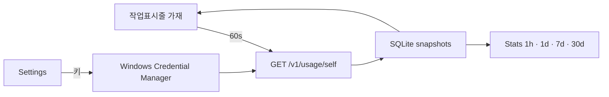

<div align="center">

```
        ⌒⌒
     ／ o  o ＼
    │  ╰──╯  │     QUOTA BAR
     ＼  ▽  ／      작업표시줄의 주황 가재
   ╰╮ ╰─┬─╯ ╭╯
    │  ╭┴╮  │
```

# 🦞 Quota Bar

**Windows 작업 표시줄에 붙어 사는 사용량 위젯**

Anthropic 호환 프록시의 누적 사용량을 시계 옆에 붙이고,  
최근 10분이 뜨거워질수록 가재가 더 미친 듯이 기어 다닙니다.

[](https://github.com/MovieHolic-Plex/quota-bar)
[](https://tauri.app)
[](https://www.rust-lang.org)
[](LICENSE)

[기능](#-가재가-보여주는-것) · [설치](#-실행) · [조작](#-조작) · [통계](#-통계-창) · [프라이버시](#-키는-저장소에-없습니다)

</div>

---

## 왜 만들었나

토큰이 어디로 새는지 보려면 브라우저를 열고, 대시보드를 찾고, 숫자를 다시 읽어야 합니다.  
Quota Bar는 그 숫자를 **작업 표시줄에 상주**시킵니다.

- 5시간 윈도우가 아닙니다. 로드밸런서 뒤에서 계정이 바뀌면 그 숫자는 의미가 없습니다.
- `GET /v1/usage/self` 의 **limits** 로 하루/주간 한도 %를 바로 그립니다. 10분·1시간은 스냅샷 차이입니다.
- 주황 가재는 장식이 아닙니다. **최근 10분 지출이 클수록 걸음이 빨라집니다.** `$100 / 10분` 에서 최고속.

---

## 가재가 보여주는 것

| 자리 | 의미 |
| :---: | --- |
| 🦞 | 주황 가재. 10분 사용량이 오르면 더 빠르게, 더 신나게 기어 다닙니다 |
| **10m** | 최근 10분의 API 환산 달러 |
| **1h** | 최근 1시간 |
| **day** | `limits` 의 전체 daily `used_percent` |
| **week** | `limits` 의 전체 weekly `used_percent` |

시계 / TrafficMonitor 클러스터 **왼쪽**에 붙습니다. Windows 11이 작업 표시줄 자식 창을 덮어버려서, 이 앱은 작업 표시줄에 딱 붙인 **최상위 팝업**으로 살아 남습니다.

---

## 실행

### 준비물

- [Rust](https://rustup.rs/) (MSVC 툴체인)
- [Visual Studio 2022 Build Tools](https://visualstudio.microsoft.com/visual-cpp-build-tools/) → **Desktop development with C++**
- WebView2
- Node.js 18+

### 소스에서 켜기

```powershell
git clone https://github.com/MovieHolic-Plex/quota-bar.git
cd quota-bar
npm install
npm run dev
```

설치본을 만들려면:

```powershell
npm run build
```

설치 파일은 `src-tauri/target/release/bundle/nsis/` 에 떨어집니다.

### 처음 한 번만

1. 트레이 아이콘 → **Settings**
2. Anthropic 호환 **Base URL** 입력
3. API 키 입력 후 저장  
   키는 Windows **자격 증명 관리자**에만 들어갑니다. 입력칸을 비우고 저장하면 기존 키를 유지합니다.

이 저장소에는 `.env` 도, 예시 키도, 실제 키도 **없습니다.**

---

## 조작

| 동작 | 결과 |
| --- | --- |
| 드래그 | 작업 표시줄 위를 따라 이동, 위치 기억 |
| 더블클릭 | 시계 옆 기본 자리로 스냅 |
| 클릭 (드래그 없이) | 지금 바로 새로고침 |
| 우클릭 | 통계 창 |
| 트레이 | Show bar · Stats · Refresh · Reset position · Settings · Quit |

---

## 통계 창

폴이 성공할 때마다 SQLite에 한 줄씩 쌓입니다.

`%APPDATA%\quotabar\quota-bar\usage.db`

| 구간 | 내용 |
| --- | --- |
| 1h / 5h / 24h / 7d / 30d / all | 스냅샷 **델타**로 만든 요청·토큰·캐시·비용 |
| 시간 / 일 차트 | 같은 델타를 막대로 |
| 이득 | API 정가 환산 − Claude Pro 월 요금 (Settings에서 변경, 기본 `$20`) |

켜 둘수록 통계가 진짜가 됩니다. 켜지 않은 구간은 비어 있습니다.

---

## 키는 저장소에 없습니다

이 레포를 클론해도 키는 따라오지 않습니다.

| 항목 | 어디에 있나 | 깃헙에 올라가나요 |
| --- | --- | :---: |
| API 키 | Windows 자격 증명 관리자 `dev.quotabar.desktop` / `api-key` | 아니오 |
| `.env` | **쓰지 않습니다.** 예시 파일도 없습니다 | 아니오 |
| 설정 | `%APPDATA%\quotabar\quota-bar\config.json` (URL·간격·위치만) | 아니오 |
| 사용량 DB | `%APPDATA%\quotabar\quota-bar\usage.db` | 아니오 |
| 에러 로그 | 키 문자열이 섞이면 `***` 로 지웁니다 | — |

설정 JSON 모양은 `config.example.json` 을 보세요. **키 필드는 없습니다.**

---

## 한도는 프록시가 직접 줍니다

`GET /v1/usage/self` 에 `limits[]` 가 붙습니다. `cost_usd` 값은 **마이크로달러**(÷ 1,000,000 = $)이고, `used_percent` / `reset_at` 이 작업 표시줄 막대의 소스입니다. limits가 없는 옛 프록시는 예전처럼 SQLite 델타로 daily %만 그립니다.

Settings의 Daily reset time은 SQLite 통계용 보조 값입니다.

## 폴링

기본 **60초**마다 `GET /v1/usage/self` 한 번.  
메시지 생성 프로브(`POST /v1/messages`)는 보내지 않습니다.  
간격은 Settings의 Poll interval 에서 바꿀 수 있고, 최솟값은 15초입니다.

---

## 구조



| 층 | 역할 |
| --- | --- |
| `src/` | 가재 캔버스, 설정, 통계 UI |
| `src-tauri/src/taskbar.rs` | Win32로 작업 표시줄에 도킹 |
| `src-tauri/src/quota.rs` | usage/self 조회, 키 문자열 마스킹 |
| `src-tauri/src/db.rs` | 스냅샷 적재와 구간 합산 |
| `src-tauri/src/config.rs` | 설정 파일 + Credential Manager |

---

## 설정 파일

로컬에만 생깁니다. 키는 여기에 쓰지 않습니다.

```json
{
  "base_url": "https://your-anthropic-compatible-proxy.example",
  "poll_interval_secs": 60,
  "bar_width": 520,
  "pro_usd": 20,
  "daily_quota_usd": 6400
}
```

---

## 라이선스

[MIT](LICENSE) — 가재를 길러도, 포크해도, 작업 표시줄에 더 붙여도 됩니다.
