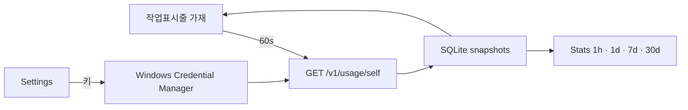

<div align="center">

```
        ⌒⌒
     ／ o  o ＼
    │  ╰──╯  │     QUOTA BAR
     ＼  ▽  ／      작업표시줄의 주황 가재
   ╰╮ ╰─┬─╯ ╭╯
    │  ╭┴╮  │
```

# 🦞 Quota Bar

**Windows 작업 표시줄에 붙어 사는 사용량 위젯**

Anthropic 호환 프록시의 누적 사용량을 시계 옆에 붙이고,  
최근 10분이 뜨거워질수록 가재가 더 미친 듯이 기어 다닙니다.

[](https://github.com/MovieHolic-Plex/quota-bar)
[](https://tauri.app)
[](https://www.rust-lang.org)
[](LICENSE)

[기능](#-가재가-보여주는-것) · [설치](#-실행) · [조작](#-조작) · [통계](#-통계-창) · [프라이버시](#-키는-저장소에-없습니다)

</div>

---

## 왜 만들었나

토큰이 어디로 새는지 보려면 브라우저를 열고, 대시보드를 찾고, 숫자를 다시 읽어야 합니다.  
Quota Bar는 그 숫자를 **작업 표시줄에 상주**시킵니다.

- 5시간 윈도우가 아닙니다. 로드밸런서 뒤에서 계정이 바뀌면 그 숫자는 의미가 없습니다.
- `GET /v1/usage/self` 의 **limits** 로 하루/주간 한도 %를 바로 그립니다. 10분·1시간은 스냅샷 차이입니다.
- 주황 가재는 장식이 아닙니다. **최근 10분 지출이 클수록 걸음이 빨라집니다.** `$100 / 10분` 에서 최고속.

---

## 가재가 보여주는 것

막대는 **먼저 막히는 것부터** 보여 줍니다.

| 자리 | 의미 |
| :---: | --- |
| 왼쪽 색 띠 | 지금 가장 위험한 한도의 색. 숫자를 읽지 않아도 곁눈으로 잡힙니다 |
| 🦞 | 주황 가재. 최근 10분 달러에 비례해 빨라집니다 |
| **윗줄** | 지금 속도로 **가장 먼저 바닥나는** 한도 + 사용률 + 리셋까지 |
| **아랫줄** | 가장 긴 창(보통 `week`)의 한도 + 사용률 + 남은 $ |
| 막대 위 흰 눈금 | 창을 고르게 썼다면 지금쯤 있어야 할 위치. 막대가 눈금보다 앞서면 과속입니다 |
| 오른쪽 스파크라인 | 최근 30분의 분당 지출. 막대 너비 430px 이상에서 나타납니다 |

색은 오직 사용률만 뜻합니다.
초록 `OK` (60% 미만) · 노랑 `Warn` (60%) · 주황 `High` (85%) · 빨강 `Full` (100%).

UI 문구는 프록시 API 용어를 그대로 씁니다. 창 이름은 `3h` · `daily` · `weekly`,
가장 먼저 바닥나는 한도는 **binding limit**, 시간당 소비는 **burn rate**,
막대 위 흰 눈금은 **pace marker** 입니다.

시계 / TrafficMonitor 클러스터 **왼쪽**에 붙습니다. Windows 11이 작업 표시줄 자식 창을 덮어버려서, 이 앱은 작업 표시줄에 딱 붙인 **최상위 팝업**으로 살아 남습니다.

---

## 실행

### 준비물

- [Rust](https://rustup.rs/) (MSVC 툴체인)
- [Visual Studio 2022 Build Tools](https://visualstudio.microsoft.com/visual-cpp-build-tools/) → **Desktop development with C++**
- WebView2
- Node.js 18+

### 소스에서 켜기

```powershell
git clone https://github.com/MovieHolic-Plex/quota-bar.git
cd quota-bar
npm install
npm run dev
```

설치본을 만들려면:

```powershell
npm run build
```

설치 파일은 `src-tauri/target/release/bundle/nsis/` 에 떨어집니다.

### 처음 한 번만

1. 트레이 아이콘 → **Settings** (막대를 가운데 버튼으로 눌러도 열립니다)
2. **General** 에서 Anthropic 호환 **Base URL** 입력
3. **Keys** 에서 API 키 추가  
   키는 Windows **자격 증명 관리자**에만 들어갑니다. 여러 개를 넣으면 위에서부터가 failover 순서입니다.

이 저장소에는 `.env` 도, 예시 키도, 실제 키도 **없습니다.**

---

## 조작

| 동작 | 결과 |
| --- | --- |
| 드래그 | 작업 표시줄 위를 따라 이동, 위치 기억 |
| 휠 | 바 너비 조절 (280–800px) |
| 더블클릭 | 시계 옆 기본 자리로 스냅 |
| 클릭 (드래그 없이) | 지금 바로 새로고침 |
| 우클릭 | 통계 창 |
| 가운데 클릭 | 설정 창 |
| 트레이 | Show bar · Stats · Refresh · Reset position · Settings · Quit |

---

## 통계 창

막대를 우클릭하면 열립니다. 맨 위 한 줄이 결론이고, 그 아래 큰 차트가 본문입니다.

| 구획 | 내용 |
| --- | --- |
| (맨 위 띠) | binding limit 한 줄. 사용률, 남은 금액, 리셋까지, 그리고 “Empties in 1h 47m at the current rate, 24m before reset” |
| **Usage over time** | 창의 주인공. 30m · 48h · 30d × Cost · Tokens · Requests. 막대에 올리면 그 구간 값이 위에 뜹니다 |
| **Limits** | 프록시가 준 **모든** 한도를 한 줄씩. pace marker 와 `vs pace` (`+34%p` 면 과속) |
| **Burn rate** | 10분 / 1시간 / 24시간 지출과 시간당 환산, 리셋 이후 누적 |
| **Windows** | 스냅샷 **델타**로 만든 표. 기록이 구간보다 짧으면 `partial` 로 표시합니다 |
| **Lifetime** | List price − 구독료 = Savings (Settings에서 변경, 기본 `$20`) |

폴이 성공할 때마다 SQLite에 한 줄씩 쌓입니다.

`%APPDATA%\quotabar\quota-bar\usage.db`

켜 둘수록 통계가 진짜가 됩니다. 켜지 않은 구간은 비어 있습니다.

---

## 키 여러 개와 failover

Settings → **Keys** 에서 키를 여러 개 넣어 둘 수 있습니다.

- 폴링마다 **모든 키**의 `/v1/usage/self` 를 읽습니다. 카드마다 3h · daily · weekly · Fable 한도가 보입니다.
- **Show / Copy** 로 전체 키를 보거나 복사합니다. 펼친 키는 30초 뒤 다시 가려집니다.
- 지금 쓰는 키(**LIVE**)가 401/403/429를 받거나, all-model 한도가 임계값(기본 98%)에 닿으면 순서상 다음 **건강한** 키로 넘어갑니다. Fable 전용 한도는 전환 조건이 아닙니다.
- **Fail back** 을 켜 두면, 윗순위 키가 임계값보다 10%p 이상 여유를 되찾았을 때 그 키로 돌아갑니다.
- 전환되면 막대에 `↪ Switched to …` 가 몇 초 뜨고, 툴팁과 통계 창에 이유가 남습니다.

## Claude Code 설정 (이 PC · 원격 서버)

Settings → **Claude Code** 에서 `~/.claude/settings.json` 을 직접 고칩니다.

- 대상: **This PC**, 그리고 `user@host` 로 추가한 SSH 머신(예: `main@mdc-server`). 자신의 `ssh` 와 `~/.ssh/config` 를 키 인증(BatchMode)으로만 씁니다.
- 건드리는 것은 `env` 의 `ANTHROPIC_BASE_URL` · `ANTHROPIC_API_KEY` / `ANTHROPIC_AUTH_TOKEN` · `ANTHROPIC_DEFAULT_{OPUS,SONNET,FABLE,HAIKU}_MODEL` 과 최상위 `model` 뿐입니다. hooks 등 나머지는 순서까지 그대로 둡니다.
- 쓰기 전에 옆에 `settings.json.quotabar-bak`(직전본)과 `settings.json.quotabar-orig`(처음 한 번)를 남깁니다.
- **Follow the live key** 를 켠 대상은 failover가 키를 바꿀 때 키와 Base URL이 같이 바뀝니다. 이미 떠 있는 Claude 세션은 다음 실행부터 새 키를 씁니다.
- 각 키 카드에는 그 키를 쓰고 있는 머신이 표시됩니다.

## 키는 저장소에 없습니다

이 레포를 클론해도 키는 따라오지 않습니다.

| 항목 | 어디에 있나 | 깃헙에 올라가나요 |
| --- | --- | :---: |
| API 키 | Windows 자격 증명 관리자 `dev.quotabar.desktop` / 키 id (첫 키는 `api-key`) | 아니오 |
| `.env` | **쓰지 않습니다.** 예시 파일도 없습니다 | 아니오 |
| 설정 | `%APPDATA%\quotabar\quota-bar\config.json` (URL·간격·위치·키 이름/순서·대상 호스트) | 아니오 |
| 사용량 DB | `%APPDATA%\quotabar\quota-bar\usage.db` | 아니오 |
| 에러 로그 | 키 문자열이 섞이면 `***` 로 지웁니다 | — |

설정 JSON 모양은 `config.example.json` 을 보세요. **키 필드는 없습니다.**

---

## 한도는 프록시가 직접 줍니다

`GET /v1/usage/self` 에 `limits[]` 가 붙습니다. `cost_usd` 값은 **마이크로달러**(÷ 1,000,000 = $)이고, `used_percent` / `reset_at` 이 작업 표시줄 막대의 소스입니다. limits가 없는 옛 프록시는 예전처럼 SQLite 델타로 daily %만 그립니다.

Settings의 Daily reset time은 SQLite 통계용 보조 값입니다.

## 폴링

기본 **60초**마다 키마다 `GET /v1/usage/self` 한 번.  
메시지 생성 프로브(`POST /v1/messages`)는 보내지 않습니다.  
간격은 Settings의 Poll interval 에서 바꿀 수 있고, 최솟값은 15초입니다.

---

## 구조


```mermaid
flowchart LR
  A[작업표시줄 가재] -->|60s| B[GET /v1/usage/self]
  B --> C[SQLite snapshots]
  C --> A
  C --> D[Stats 1h · 1d · 7d · 30d]
  E[Settings] -->|키| F[Windows Credential Manager]
  F --> B
```

| 층 | 역할 |
| --- | --- |
| `src/theme.css` | 색·간격·미터 등 세 창이 공유하는 디자인 토큰 |
| `src/common.js` | 한도 정규화, 페이스·소진 예측, 숫자 포맷 (세 창 공용) |
| `src/index.html` · `main.js` · `styles.css` | 작업 표시줄 막대와 가재 캔버스 |
| `src/stats.html` · `stats.js` · `stats.css` | 통계 창 |
| `src/settings.html` · `settings.js` · `settings.css` | 설정 창 (Keys · Claude Code · General) |
| `src-tauri/src/taskbar.rs` | Win32로 작업 표시줄에 도킹 |
| `src-tauri/src/quota.rs` | usage/self 조회, 키 문자열 마스킹 |
| `src-tauri/src/db.rs` | 스냅샷 적재와 구간 합산 |
| `src-tauri/src/config.rs` | 설정 파일 + Credential Manager |
| `src-tauri/src/keys.rs` | 키 상태 판정과 failover 선택 |
| `src-tauri/src/claude_cfg.rs` | Claude Code `settings.json` 읽기/패치 (로컬 · SSH) |

---

## 설정 파일

로컬에만 생깁니다. 키는 여기에 쓰지 않습니다.

```json
{
  "base_url": "https://your-anthropic-compatible-proxy.example",
  "poll_interval_secs": 60,
  "bar_width": 560,
  "pro_usd": 20,
  "daily_quota_usd": 6400,
  "daily_reset_utc": "06:34"
}
```

`pro_usd` · `daily_quota_usd` · `daily_reset_utc` 는 Settings 창에서도 바꿀 수 있습니다.

---

## 라이선스

[MIT](LICENSE) — 가재를 길러도, 포크해도, 작업 표시줄에 더 붙여도 됩니다.
